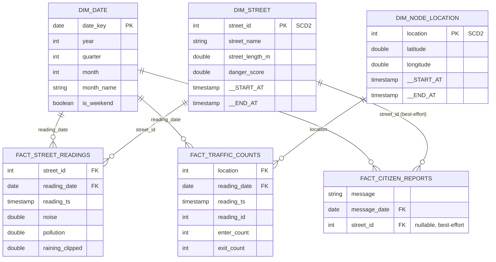

# Day 6 — Gold Data Model

## Star Schema

## Grain & Key Reference

| Table | Type | Grain / PK | FKs |
|---|---|---|---|
| `dim_date` | Static | `date_key` | — |
| `dim_street` | SCD2 | `street_id` (natural = surrogate, already a clean int) | — |
| `dim_node_location` | SCD2 | `location` (natural = surrogate) | — |
| `fact_street_readings` | Fact | `(street_id, reading_ts)` | `street_id → dim_street`, `reading_date → dim_date` |
| `fact_traffic_counts` | Fact | `(location, reading_ts, reading_id)` — corrected from `(location, reading_ts)`, see requirements_and_assumptions.md | `location → dim_node_location`, `reading_date → dim_date` |
| `fact_citizen_reports` | Fact | `(message, message_date, message_hour)` — no id column exists in source | `message_date → dim_date`, `street_id → dim_street` (nullable, best-effort) |

## Why no crc32 surrogate keys

The reference project generates surrogate keys via `crc32(lower(brand)|lower(model))` because its natural keys are composite strings. VStone's natural keys (`street_id` 1–36, `location` 1–14) are already clean small integers confirmed unique in Day 1 profiling — using them directly as both natural and surrogate key is simpler and avoids an unnecessary hash collision surface for no benefit.

## `fact_citizen_reports.street_id` — known limitation

Resolved by checking whether a message's cleaned text *contains* a street's exact name (`streets_list_silver.street_name`), not a real foreign key in the source data. Consequences documented rather than hidden:
- A message mentioning no recognizable street name → `street_id IS NULL`.
- A message that happens to contain two street names → only one is kept (`ROW_NUMBER()` tie-break, arbitrary — not claimed correct).
- `agg_citizen_reports_by_street` only counts the resolved subset (`street_id IS NOT NULL`), so its totals will undercount actual report volume by design.

## Audit chain

Every Gold table carries `gold_load_dt`. Facts carry the full chain back through Silver and Bronze (`bronze_load_dt → silver_load_dt → [business_load_dt] → gold_load_dt`) so any row can be traced to the exact ingestion technique and file it came from.
